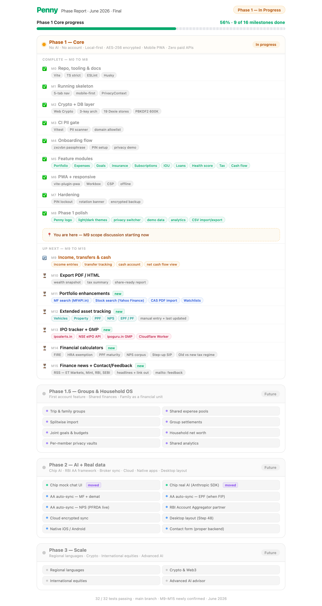

# Penny — Developer Guide for Claude Sessions

This file is read at the start of every Claude Code session. It tells you where we are, what the rules are, and what to do next.

---

## What this project is

**Penny** is an India-first personal wealth management PWA with an AI advisor called **Chip**. Privacy-first: local-first, AES-256 encrypted, zero trackers, zero backend in Phase 1.

- Working directory: `/Users/hemant.sharma/Projects/penny`
- Stack: React 19 + TypeScript (strict) + Vite + Tailwind v4 + Dexie.js + Web Crypto API
- Target: Mobile-first PWA, `max-w-[430px] mx-auto` desktop layout
- Currency/locale: `en-IN`, Indian Rupees (₹)

---

## Current milestone status

| Milestone                            | Status                                              |
| ------------------------------------ | --------------------------------------------------- |
| M0: Repo + tooling + docs            | ✅ Complete                                         |
| M1: Running skeleton (5-tab layout)  | ✅ Complete                                         |
| M2: Crypto + DB layer                | ✅ Complete                                         |
| M3: CI PII gate                      | ✅ Complete                                         |
| M4: Onboarding flow                  | ✅ Complete                                         |
| M5: Feature modules (no AI)          | ✅ Complete                                         |
| M6: PWA + responsive polish          | ✅ Complete                                         |
| M7: Hardening                        | ✅ Complete                                         |
| M8: Phase 1 polish                   | ✅ Complete                                         |
| M9: Income, transfers & cash         | ✅ Complete                                         |
| M10: IPO tracker + GMP               | ✅ Complete                                         |
| M11: Extended asset tracking         | 🚧 In progress by HEMANT                           |
| M12: Portfolio enhancements          | 🚧 In progress by HEMANT                           |
| M13: Financial calculators           | 🚧 In progress by PANKHURI                         |
| M14: Finance news + Contact/Feedback | ⏳ Future                                           |
| M15: Export PDF/HTML                 | ⏳ Future                                           |

**M5 step tracker:**

| Step  | Feature                                                      | Status  |
| ----- | ------------------------------------------------------------ | ------- |
| Infra | formatters, repositories, mockChip, useRepository hook       | ✅ Done |
| 22    | Home dashboard (net worth card, Chip insights, module tiles) | ✅ Done |
| 23    | Expenses (list, form, categories, hashtags, budgets)         | ✅ Done |
| 24    | Goals (cards, progress rings, SIP calculator)                | ✅ Done |
| 25    | Portfolio (holdings, live price fetch, report card)          | ✅ Done |
| 26    | Insurance (policy cards, form, renewal tracker)              | ✅ Done |
| 27    | Subscription detection (3-pass algorithm)                    | ✅ Done |
| 28    | IOU tracker (lent/borrowed, ageing alerts)                   | ✅ Done |
| 29    | Loan scenarios (6 on-device calculations)                    | ✅ Done |
| 30    | Financial health score (0–100 composite)                     | ✅ Done |
| 31    | Tax awareness (80C/80D/24B, LTCG/STCG)                       | ✅ Done |
| 32    | Cash flow forecast (week/month ahead)                        | ✅ Done |

**M5 is complete.** Step 33 (Chip tab) moved to M9.

**M6 step tracker:**

| Step | Feature                                                  | Status  |
| ---- | -------------------------------------------------------- | ------- |
| 34   | PWA setup (vite-plugin-pwa, Workbox, CSP, offline icons) | ✅ Done |
| 35   | Responsive audit (360/390/768px, tap targets ≥44px)      | ✅ Done |

**M6 is complete.**

**M7 step tracker:**

| Step | Feature                                                                  | Status  |
| ---- | ------------------------------------------------------------------------ | ------- |
| 36   | PIN lockout UI (countdown, exponential backoff, attempt warnings)        | ✅ Done |
| 37   | 21-day PIN rotation banner (AuthGuard always checks, shown after unlock) | ✅ Done |
| 38   | Encrypted backup/restore (.penny export/import, passphrase-derived MK)   | ✅ Done |
| 39   | Final CI pass + CLAUDE.md updated                                        | ✅ Done |

**M7 is complete.**

**M8 step tracker:**

| Step | Feature                                                                         | Status                 |
| ---- | ------------------------------------------------------------------------------- | ---------------------- |
| 40   | Visual identity — Penny SVG logo, Chip avatar, updated PWA icons                | ✅ Done                |
| 41   | Settings drawer — module visibility toggles, font scale slider                  | ✅ Done                |
| 42   | Privacy mode switcher — 3-segment toggle, PIN gate for Open, theme tinting      | ✅ Done                |
| 42b  | Light/dark theme system (Penny Light + Penny Dark)                              | ✅ Done                |
| 43   | Demo data seeding — realistic sample records on first onboarding                | ✅ Done                |
| 44   | Chip mock chat UI — full message UI wired to mockChip.ts                        | ⏳ Deferred to Phase 2 |
| 45   | Expense categories rethink + analytics tab + budget tab polish                  | ✅ Done                |
| 46   | Import expenses — Penny CSV template + YNAB/Cashew/MoneyView parsers, 3-step UI | ✅ Done                |
| 47   | Export CSV — AES-256 password-protected ZIP, date range picker                  | ✅ Done                |
| 48   | Responsive/laptop layout                                                        | ⏳ Deferred to Phase 2 |
| 49   | Final CI pass + CLAUDE.md updated                                               | ✅ Done                |

**M8 is complete.** Steps 44 (Chip chat UI) and 48 (desktop layout) deferred to Phase 2.

**M9 step tracker:**

| Step | Feature                                                                                     | Status      |
| ---- | ------------------------------------------------------------------------------------------- | ----------- |
| 50   | Data model — Account type + Dexie v2, accountsRepo, AccountsPage, router wiring             | ✅ Done     |
| 51   | TransactionForm — type selector (Expense/Income/Transfer), account selectors, speed dial FAB | ✅ Done     |
| 52   | Transactions tab — all types in list with type-specific icons/colors, page rename            | ✅ Done     |
| 53   | Demo data — 3 accounts, salary income ×3, freelance income, CC + savings transfers           | ✅ Done     |
| 54   | Home dashboard — accounts strip with live balances                                           | ✅ Done     |
| 55   | Final CI pass + CLAUDE.md updated                                                            | ✅ Done        |

**M9 is complete.**

**M10 step tracker:**

| Step | Feature                                                                                          | Status                  |
| ---- | ------------------------------------------------------------------------------------------------ | ----------------------- |
| 56   | IPO types + ipoClient (investorgain.com, cache, FY constants)                                    | ✅ Done                 |
| 57   | useIpos hook + IPO_TRACKER.md research doc                                                       | ✅ Done                 |
| 58   | IPO tab in PortfolioPage — sub-tabs (Upcoming/Open/Closed/Listed), refresh, empty states         | ✅ Done                 |
| 59   | CSP fix (webnodejs.investorgain.com) + FY year fix (2026/2026-27) + live data wiring             | ✅ Done                 |
| 60   | IPO cards redesign — 2-column layout (financials left, dates right), all 4 tabs                  | ✅ Done                 |
| 61   | Demo data seeding                                                                                | ⏳ Skipped (live data only) |
| 62   | IPO detail modal — 4-col grids, subscription API (QIB/HNI/Retail), day-wise table, final CI pass | ✅ Done                 |

**M10 is complete.** Step 61 skipped — IPO data comes from live investorgain.com API, no demo seeding needed.

**M11 step tracker (in progress):**

| Step | Feature                                                                                                         | Status          |
| ---- | --------------------------------------------------------------------------------------------------------------- | --------------- |
| 63   | Holdings sub-tab shell (6 tabs) + Retirement sub-tab (NPS/PPF/EPF cards, staleness indicators, form fields)     | ✅ Done         |
| 63+  | NPS live NAV tracking — npsnav.in client, lifecycle fund tables (LC-75/50/25/BLC), auto choice allocation pills, year-by-year schedule sheet, active choice NAV × units corpus | ✅ Done |
| 63++ | PPF full tracking — passbook ledger (deposit/interest/withdrawal), before/after-5th badges, FY deposit bar vs ₹1.5L, corpus projection, Add Transaction sheet | ✅ Done |
| 63+++| EPF full tracking — employment history (company + basic salary + from/to), transaction ledger (employee/employer/interest/transfer/withdrawal), contribution auto-calc per employer period, retirement projection at 58, pro-rata partial months | ✅ Done |
| 64   | Real Assets — vehicles (RC fetch via vahandetails.com, IRDA depreciation, challan cards) + property sub-tab, 90-day staleness UX | ✅ Done |
| 65   | Fixed Income — FD/RD maturity auto-calc + compound interest projection                                          | ✅ Done         |
| 66   | Precious Metals — Gold + Silver live prices via MFAPI.in (Gold BeES NAV×100, Silver ETF NAV)                    | ✅ Done         |
| 67   | Stocks — enhanced cards, Yahoo Finance symbol search                                                            | ⏳               |
| 68   | Mutual Funds — enhanced cards, MFAPI.in scheme search                                                          | ⏳               |
| 69   | Home dashboard + Portfolio restructure                                                                          | ⏳               |
| 70   | PDF Imports — CAS PDF (MF/stocks via casparser) + EPFO passbook PDF (employment history + transactions via PDF.js) | ⏳           |
| 71   | Watchlist                                                                                                       | ⏳               |
| 72   | Final CI pass + CLAUDE.md updated                                                                               | ⏳               |

**EPF data model (step 63+++):**
- `EpfEmployer`: `{ id, companyName, basicSalary, fromDate, toDate?, employeeContribPct (default 12) }`
- `EpfTransaction`: `{ id, type (employee/employer/interest/transfer_in/withdrawal/advance), wagesMonth (YYYY-MM), date, employeeAmount?, employerAmount?, pensionAmount?, note? }`
- Card shows: contribution breakdown per employer period, expected vs actual balance, monthly contribution from current employer, retirement corpus projection at 58
- PDF import deferred to step 70 (grouped with CAS PDF — same PDF.js infrastructure)

**FD/RD data model (step 65):**
- `fdSubType`: `'fd' | 'rd'` stored in `assetMeta`
- FD fields: `fdBank`, `fdStartDate` (epoch ms), `fdCompoundingFreq` (`monthly | quarterly | half-yearly | yearly | at_maturity`), `interestRate`, `maturityDate` (epoch ms), `investedAmount` (principal)
- RD fields: `fdBank`, `fdStartDate` (epoch ms), `rdMonthlyInstallment`, `rdTenureMonths`, `interestRate`; `investedAmount` = installment × tenure (total committed)
- `currentValue` = accrued amount (live, recalculated from `calcFdMaturity` / `calcRdMaturity` in `src/core/fd/fdCalculations.ts`)
- Pure calculation functions in `src/core/fd/fdCalculations.ts`: `calcFdMaturity` (compound P×(1+r/n)^nt) + `calcRdMaturity` (iterative quarterly per-installment, Indian bank standard)

**Precious metals data model (step 66):**
- `metalType`: `'gold' | 'silver'` stored in `assetMeta`, both use `assetClass: 'gold'`
- `metalCategory`: `'jewellery' | 'coin' | 'bar' | 'digital' | 'other'`
- `metalKarat`: `14 | 18 | 22 | 24` (gold only); `metalPurity`: `'999' | '925' | '800' | 'other'` (silver)
- `metalWeightGrams`, `metalPurchasePricePerGram` — weight and cost basis per gram
- Live price: MFAPI.in scheme 140088 (Gold BeES) NAV × 100 = ₹/gram 24K; scheme 149758 (Silver ETF) NAV = ₹/gram
- Karat-adjusted value: `weight × (karat/24) × spot_24K_per_gram`

**Next step when you pick up a session:** Step 67 — Stocks (enhanced cards, Yahoo Finance symbol search).

**Full Phase 1 roadmap (M9–M15):**

| Milestone | Scope                                                                                                         | Key data sources                                                    |
| --------- | ------------------------------------------------------------------------------------------------------------- | ------------------------------------------------------------------- |
| M9        | Income entries, transfer tracking, cash account, net cash flow view                                           | Local DB only                                                       |
| M10       | IPO tracker + GMP — Upcoming/Open/Closed/Listed, subscription multiples, GMP                                  | ipoalerts.in (free), NSE eIPO API via Cloudflare Worker, ipoguru.in |
| M11       | Extended asset tracking — NPS (live NAV), PPF (passbook ledger + projection), EPF (employment history + transaction ledger), vehicles, property, FD/RD, precious metals, stocks + MF enhanced cards | Manual + npsnav.in |
| M12       | Portfolio enhancements — MF/stock search, CAS PDF import, watchlists                                          | MFAPI.in, Yahoo Finance, casparser SDK                              |
| M13       | Financial calculators — FIRE, HRA exemption, PPF maturity, NPS corpus, step-up SIP, old vs new tax regime     | Pure on-device TypeScript                                           |
| M14       | Finance news (RSS — ET Markets, Mint, RBI, SEBI, headlines + link-out) + Contact/Feedback (mailto: deep-link) | RSS feeds, no backend                                               |
| M15       | Export PDF + HTML — wealth snapshot, tax summary, share-ready report                                          | On-device render                                                    |

**Phase boundaries:**

- Phase 1 ends after M15 — full financial life tracking, zero paid APIs, zero backend (except 1 Cloudflare Worker for IPO)
- Phase 1.5 — Groups & Household OS (shared expenses, family vaults, joint goals, household net worth)
- Phase 2 — Chip AI (real Anthropic SDK), RBI AA framework automated sync (MF/demat/EPF when FIP/NPS), desktop layout, cloud sync, native apps
- Phase 3 — Regional languages, crypto/Web3, international equities, advanced AI advisor

---

## UI / Modal design principles

- **No bottom sheets.** All modals, drawers, and popups must appear centred between the app header and the bottom nav — never sliding up from the bottom edge.
- **Always visible header + nav.** The header (≈48 px) and bottom nav (≈64 px) must never be obscured by a modal. Use `paddingTop: 56, paddingBottom: 72` (or equivalent) on the fixed overlay so the modal floats between them.
- **Horizontal margin.** Modals must never stretch edge-to-edge. Use `px-4` (16 px each side) on the overlay and `max-w-[430px]` on the card so there is always a visible gap between the card and the screen edges.
- **Scrollable body.** Long content (forms, detail views) must scroll inside the card (`overflow-y-auto flex-1`) — the header and footer actions of the card stay sticky.
- **Standard z-index ladder:** bottom nav `z-50` → app header `z-40` → modals `z-60` → nested modals / confirmation dialogs `z-70`.

---

## Architecture rules (enforced by ESLint)

1. **`@anthropic-ai/sdk`** may ONLY be imported from `src/core/ai-safety/anthropicClient.ts`
2. **`dexie`** may ONLY be imported from `src/core/db/`
3. **Feature modules** must not cross-import — only from `core/`, `components/`, `context/`, `lib/`
4. **`no-console`** is a warning — never log PII

Never disable these rules with `eslint-disable` comments.

---

## Encryption rules

- **Never access Dexie tables directly** from feature code
- Always use `EncryptedRepository<T>` from `src/core/db/repository.ts`
- The Master Key lives in memory only (`src/core/crypto/keystore.ts`) — cleared on session expiry
- Three-key architecture: passphrase → MK (PBKDF2 600K) → KEK (PBKDF2 200K) → wraps MK

---

## PII rules (see `docs/PRIVACY_RULES.md` for full list)

- `buildUserContext()` in `src/core/ai-safety/buildUserContext.ts` is the ONLY path to Anthropic
- PII categories: direct identifiers (stripped), financial IDs (stripped), bank/lender names (generalised), amounts (banded to ₹10K), merchant names (→ category)
- The CI gate in `tests/pii-gate/piiGate.test.ts` blocks deployment on any PII leak — never skip it

---

## Database schema summary (all 19 stores)

See `docs/SCHEMA.md` for the full field list. Quick reference:

**Encrypted stores** (all sensitive data):
`profile`, `holdings`, `expenses`, `expense_categories`, `budgets`, `hashtags`, `goals`, `goal_contributions`, `assets`, `liabilities`, `insurance_policies`, `chip_insights`, `ai_call_log`, `security`, `subscriptions`, `personal_ious`, `credit_profile`

**Plain stores** (public/cached data, no PII):
`price_cache`, `privacy_stats`

All primary keys are UUIDs (not auto-increment — sync-ready).

---

## Privacy modes

```ts
type PrivacyMode = 'safe' | 'privacy' | 'open';
```

- `safe` (amber, default): amounts masked as ••••
- `privacy` (violet): module names only, no amounts
- `open` (green): everything visible, PIN required to switch to

Provided by `PrivacyContext` in `src/context/PrivacyContext.tsx`. Use `usePrivacy()` hook everywhere — never check mode directly in feature components.

---

## Navigation structure

```
/onboarding/*       Pre-auth: splash, privacy promise, setup, demo, intro, simulated dashboard
/app/home           Home dashboard (default after onboarding)
/app/portfolio      Portfolio module
/app/expenses       Expenses module
/app/goals          Goals module
/app/insurance      Insurance (accessible from Home)
/app/chip           Chip AI chat
```

Bottom nav tabs: Home · Portfolio · Chip (FAB, centred) · Expenses · Goals

---

## Design tokens

```css
--color-primary: #00a86b; /* Penny green */
--color-safe: #f59e0b; /* Amber — Safe mode */
--color-privacy: #7c3aed; /* Violet — Privacy mode */
--color-open: #10b981; /* Emerald — Open mode */
```

---

## Semantic theme utilities (use these in all components)

Defined in `src/index.css` via `@layer utilities`. These reference CSS variables so they auto-switch between Penny Light and Penny Dark — **never use hardcoded Tailwind colors** (`bg-white`, `text-slate-900`, `border-slate-100`) in new components.

| Class                 | What it does                                                       |
| --------------------- | ------------------------------------------------------------------ |
| `bg-surface`          | Card / panel background (`--color-surface`)                        |
| `bg-surface-2`        | Slightly deeper background (`--color-surface-secondary`)           |
| `bg-surface-3`        | Body / page background (`--color-surface-tertiary`)                |
| `text-primary`        | Primary text (`--color-text-primary`)                              |
| `text-secondary`      | Secondary / label text (`--color-text-secondary`)                  |
| `text-tertiary`       | Muted / placeholder text (`--color-text-tertiary`)                 |
| `border-theme`        | Standard border color (`--color-border`)                           |
| `border-theme-strong` | Emphasis border color (`--color-border-strong`)                    |
| `surface`             | Card shorthand: `bg-surface` + `1px solid border-theme`            |
| `input-surface`       | Input shorthand: bg + text + border-color for `<input>`/`<select>` |

**Usage example:**

```tsx
<div className="surface rounded-2xl p-4">
  <h2 className="text-primary font-semibold">Title</h2>
  <p className="text-secondary text-sm">Subtitle</p>
  <input className="input-surface border rounded-xl px-3 py-2" />
</div>
```

For inline styles that reference CSS variables (e.g. SVG `fill`, dynamic colors), continue using `style={{ color: 'var(--color-text-primary)' }}`.

---

## Phase 1 feature list (no AI, no account)

**5 core modules:** Portfolio, Expenses, Net Worth & Goals, Insurance, Privacy system

**BRD v4.0 additions** (all on-device):

- Subscription detection, IOU tracker, loan repayment scenarios (6 types), liabilities expanded (12 types, 22 fields)

**WhatsNext features** (use existing data):

- Tax awareness (80C/80D/24B, LTCG/STCG), Financial health score (0–100), Cash flow forecast

**M9–M15 additions (confirmed, all free):**

- Income & transfer tracking, cash account, net cash flow view
- Export PDF/HTML — wealth snapshot + tax summary
- MF/stock searchable add flow (Groww-style), CAS PDF import (all brokers in one file), watchlists
- Extended asset tracking — vehicles, property, PPF, NPS, EPF/PF (manual entry, last-updated timestamp)
- IPO tracker + GMP — full lifecycle display (Upcoming/Open/Closed/Listed), live subscription multiples, Grey Market Premium
- Financial calculators — FIRE, HRA exemption, PPF maturity, NPS corpus, step-up SIP, old vs new tax regime
- Finance news (RSS — ET Markets, Mint, RBI, SEBI), Contact/Feedback page

**Free API sources used in Phase 1:**

| API                        | Used for                                      | Cost                        |
| -------------------------- | --------------------------------------------- | --------------------------- |
| MFAPI.in                   | MF search, NAV, scheme info                   | Free, no auth               |
| Yahoo Finance (unofficial) | Stock search, price, fundamentals             | Free, no key                |
| ipoalerts.in               | IPO metadata (dates, price band, lot size)    | Free tier 750 req/mo        |
| NSE eIPO Query Server      | Live IPO subscription multiples (QIB/NII/RII) | Free, via Cloudflare Worker |
| ipoguru.in                 | Live GMP + GMP%                               | Free tier 300 req/day       |
| casparser SDK              | Parse CDSL/CAMS CAS PDF → structured holdings | Open-source                 |
| RSS feeds                  | Finance news headlines                        | Free                        |

---

## Chip AI (Phase 2 — future)

- `mockChip.ts` provides simulated responses during Phase 1 development
- `CHIP_MODE: 'mock' | 'real'` flag controls which path is used
- Real path: `buildUserContext()` → PII scanner → Anthropic SDK → `claude-sonnet-4-6`
- Temp: 0.3 (analysis), 0.7 (conversation). Max tokens: 1200 / 800
- Chip mock chat UI (step 44) also deferred to Phase 2 — ChipPage is currently a stub

---

## Open decisions

| #   | Decision                            | Status                                          |
| --- | ----------------------------------- | ----------------------------------------------- |
| D1  | PBKDF2 iteration counts (600K/200K) | Confirm after benchmarking on mid-range Android |
| D2  | Passphrase strength (zxcvbn ≥ 3)    | Confirmed                                       |
| D3  | PWA hosting                         | Cloudflare Pages recommended                    |
| D4  | Anthropic API key handling          | User-supplied, encrypted with MK                |

---

## Key files

| File                                     | Purpose                                                |
| ---------------------------------------- | ------------------------------------------------------ |
| `src/core/db/schema.ts`                  | All 19 Dexie stores — everything depends on this       |
| `src/core/crypto/securityManager.ts`     | All reads/writes flow through this                     |
| `src/core/ai-safety/buildUserContext.ts` | Only path to Anthropic                                 |
| `src/core/ai-safety/mockChip.ts`         | All Phase 1 dev runs on this                           |
| `src/core/import/importParsers.ts`       | CSV parsers: Penny, YNAB, Cashew, MoneyView            |
| `src/core/export/exportCsv.ts`           | CSV export + AES-256 ZIP download (zip.js, no workers) |
| `src/core/db/seedDemoData.ts`            | Demo data seeding — called once after onboarding       |
| `tests/pii-gate/piiGate.test.ts`         | CI gate — never skip                                   |
| `src/context/PrivacyContext.tsx`         | Privacy mode — wraps entire app                        |
| `src/context/SettingsContext.tsx`        | Module visibility + font scale (localStorage)          |
| `src/router/index.tsx`                   | All routes + AuthGuard                                 |


