# Database structure review + performance findings (2026-08-29)

**Status: done.** A one-off review, not an ongoing initiative — kept here per the project's
plan-file convention so the findings/ER diagram/recommendations survive beyond the originating
session. See `docs/ARCHITECTURE.md`'s matching 2026-08-29 decision-log entries for what actually
shipped as a result.

**Outcome:** `apps/web-react` was retired and deleted; `packages/core/src/core/db/schema.ts`
dropped Dexie (now a plain in-memory `RowStore`, used only by `vitest`). Two of the four follow-up
recommendations shipped the same day — a referential-integrity consistency checker
(`packages/core/src/core/db/consistencyCheck.ts`) and Analytics' lazy view computation
(`useExpenseAnalytics.ts`). A third (cached running balance for `computeBalance()`'s repeated
scans) was deliberately deferred after a real silent-drift risk was flagged. The full restructure
(real plaintext columns + DB-enforced `FOREIGN KEY`s) and moving any data to Cloudflare were both
explicitly decided against — see Parts 3/10 below.

---

## Part 1 — Retire `apps/web-react` entirely

`apps/web-react` had been frozen since 2026-07-31 (no further changes) and was fully superseded by
`apps/mobile`. The one real blocker: `schema.native.ts` (what `apps/mobile` actually runs) had zero
automated test coverage — the entire `vitest` suite ran against `schema.ts` (Dexie) instead, since
that's the only engine Node can execute. Deleting `apps/web-react`/`schema.ts` outright would have
deleted the DB layer's entire automated safety net at the same time.

**Sequencing used:** rewrote `schema.ts` in place (same filename/import path/exported shape) as a
plain in-memory `RowStore` implementation of the same contract `schema.native.ts` already
implements, confirmed the full test suite passed unchanged against it, **then** deleted
`apps/web-react`. Also retired: `docs/MOBILE_PARITY.md`, `docs/ANDROID_EMULATOR.md`,
`.claude/agents/web-developer.md`/`parity-auditor.md`, `.claude/skills/parity-sweep/` — nothing
left for them to target once there was only one app.

## Part 2 — The database today (op-sqlite / `schema.native.ts`)

Every table, every column, PK/FK relationships with crow's-foot cardinality — scoped to
`schema.native.ts` only (the engine `apps/mobile` actually runs on):

```mermaid
erDiagram
  ACCOUNTS {
    string id PK
    string name
    string type
    number openingBalance
    string color
    string icon
    boolean hideInSafeMode
    number openingBalanceAsOfDate
    json coveredStatementRanges
    json anchorReference
    json dismissedVerificationFindings
    json dismissedSkippedRows
    string bankId
    string last4
    boolean isClosed
    boolean isDefault
  }
  EXPENSE_CATEGORIES {
    string id PK
    string name
    string icon
    string color
    string intentGroup
    boolean isDefault
    boolean isGroup
    string parentId FK "self, custom groups"
    string applicableTo
    boolean hideInSafeMode
  }
  EXPENSES {
    string id PK
    number amount
    string merchant
    string categoryId FK
    number date
    string type
    string notes
    string_array hashtags
    string paymentMode FK
    string accountId FK
    string toAccountId FK
    string eventId FK
    string recurringRuleId FK
    boolean isRecurring
    string receiptDataUrl
    number statementBalance
    number reconciledSeq
  }
  BUDGETS {
    string id PK
    string categoryId FK
    number amount
    string period
    number startDate
  }
  HASHTAGS {
    string id PK
    string name
    number usageCount
    boolean setAside
    boolean hideInSafeMode
    number createdAt
  }
  GOALS {
    string id PK
    string name
    number targetAmount
    number currentAmount
    number targetDate
    number sipAmount
    string sipFrequency
    number expectedReturn
    string icon
    string color
    boolean countsTowardSafeToSpend
  }
  GOAL_CONTRIBUTIONS {
    string id PK
    string goalId FK
    number amount
    number date
    string notes
    string origin
    string linkedTxnId FK
    number updatedAt
  }
  PERSONS {
    string id PK
    string name
    string phone
    string notes
    string linkedMemberId
    boolean isArchived
    string promotedToGroupId FK
    number createdAt
    number updatedAt
  }
  LEDGER_ENTRIES {
    string id PK
    string personId FK
    string kind
    number amount
    number date
    number dueDate
    string description
    string notes
    string settleDirection
    string origin
    string linkedTxnId FK
    string remoteId
    number createdAt
    number updatedAt
  }
  PERSONAL_IOUS {
    string id PK
    string direction
    number amount
    string description
    number date
    number dueDate
    boolean isSettled
    number settledAt
    string notes
  }
  LIABILITIES {
    string id PK
    string type
    string name
    number principalAmount
    number currentBalance
    number interestRate
    number emiAmount
    number tenureMonths
    number startDate
    number endDate
    string lenderName
    string accountNumber
    string note
  }
  INSURANCE_POLICIES {
    string id PK
    string type
    string name
    string insurer
    string policyNumber
    number sumAssured
    number premium
    string premiumFrequency
    number startDate
    number renewalDate
    number maturityDate
    string_array nominees
    string note
  }
  HOLDINGS {
    string id PK
    string assetClass
    string name
    number units
    number purchasePrice
    number currentValue
    number purchaseDate
    json assetMeta
    string note
  }
  CREDIT_PROFILE {
    string id PK
    number score
    string scoreRange
    number reportDate
    string summary
    string raw_report_encrypted
  }
  SUBSCRIPTIONS {
    string id PK
    string name
    number amount
    string frequency
    string categoryId FK
    number nextDueDate
    number detectedAt
    boolean confirmedByUser
  }
  PROFILE {
    string id PK
    string displayName
    string currency
    string locale
    boolean onboardingComplete
    string dob
    string employmentType
    string username
    string userId
    string deviceId
    string plan
    boolean demoSeeded
  }
  SECURITY {
    string id PK "singleton"
    string mkSalt
    string kekSalt
    string encryptedMasterKey
    string encryptedMasterKeyByPassphrase
    string passphraseKekSalt
    string recoverySalt
    string recoveryPublicJwk
    string passphraseVerifier
    number pinAttempts
    number lockedUntil
    number pinChangedAt
    number passphraseAttempts
    number passphraseLockedUntil
    number passphraseChangedAt
    number sessionExpiresAt
    number wipeAfterAttempts
  }
  CHIP_INSIGHTS {
    string id PK
    string module
    string insight
    string reasoning
    string doNothingConsequence
    string confidence
    number createdAt
    number version
  }
  AI_CALL_LOG {
    string id PK
    string module
    string prompt
    number tokensUsed
    number createdAt
  }
  ACTIVITY_LOG {
    string id PK
    number timestamp
    string action
    string entityType
    string entityId FK "polymorphic — any table"
    string summary
    string actor
    string snapshot
    string cascade
    string diff
    number entityCount
    string restorePointId
    boolean restored
    string relatedLogId FK "self"
  }
  MERCHANT_MEMORY {
    string id PK "type::normalizedDescription"
    string description
    string type
    string categoryId FK
    string accountId FK
    string paymentMode FK
    number amount
    number usageCount
    number updatedAt
  }
  TRANSACTION_TEMPLATES {
    string id PK
    string label
    string type
    string description
    string categoryId FK
    number amount
    string accountId FK
    string paymentMode FK
    number createdAt
  }
  DEVICE_KEYS {
    string id PK "kind"
    string kind
    json publicJwk
    json privateJwk
    number createdAt
    number updatedAt
  }
  GROUP_KEYS {
    string id PK "groupId:keyEpoch"
    string groupId FK
    number keyEpoch
    json jwk
    number createdAt
    number updatedAt
  }
  SYNC_CURSOR {
    string id PK "scope"
    string scope
    number version
    number seq
    string remoteTag
    number pushedAt
    number lastBackupAt
    number createdAt
    number updatedAt
  }
  GROUPS {
    string id PK
    string type
    string name
    string role
    string status
    string ownerId
    number keyEpoch
    string historyVisibility
    number joinedAt
    number createdAt
    number updatedAt
  }
  GROUP_MEMBERS {
    string id PK "groupId:userId"
    string groupId FK
    string userId
    string displayName
    string role
    string status
    string linkedPersonId FK
    boolean accountless
    string upgradedToUserId
    number joinedAt
    number leftAt
    number createdAt
    number updatedAt
  }
  GROUP_EVENTS {
    string id PK "eventId"
    string groupId FK
    number seq
    number lamport
    string authorId
    number keyEpoch
    string type
    json payload
    number createdAt
    number updatedAt
  }
  BANK_STATEMENT_IMPORTS {
    string id PK
    string batchId
    string accountId FK
    string rawNarration
    string normalizedKey
    number date
    number amount
    string type
    string linkedTxnId FK
    number createdAt
    number sourceRowIndex
  }
  BANK_NARRATION_OVERRIDES {
    string id PK
    string keyword
    string normalizedKey
    number createdAt
    number updatedAt
  }
  BANK_CASH_WITHDRAWAL_CODES {
    string id PK
    string bankId
    string code
    string label
    string direction
    boolean isDefault
    number createdAt
    number updatedAt
  }
  PAYMENT_MODES {
    string id PK "slug"
    string label
    string icon
    string color
    boolean isDefault
    number createdAt
    number updatedAt
  }
  RETIREMENT_PLAN {
    string id PK "singleton"
    number retirementAge
    number expectedReturnPct
    number inflationPct
    number swrPct
    number monthlyInvestment
    number monthlyExpenseOverride
    number createdAt
    number updatedAt
  }
  NET_WORTH_SNAPSHOTS {
    string id PK
    string monthKey
    number investableCorpus
    number netWorth
    number capturedAt
  }
  SMS_TRANSACTIONS {
    string id PK
    string contentHash
    string sender
    string rawBody
    number receivedAt
    number date
    number amount
    string direction
    string transactionType
    string counterparty
    string accountLast4
    string cardLast4
    string referenceNumber
    number balance
    string bankId
    string paymentModeGuess FK
    string accountId FK
    string status
    string reviewReason
    string_array possibleMatchExpenseIds FK
    string_array possibleDuplicateSmsIds FK "self"
    string linkedTxnId FK
    number createdAt
    number updatedAt
  }
  SMS_ACCOUNT_MAPPINGS {
    string id PK
    string kind
    string mappingKey
    string rawValue
    string accountId FK
    number createdAt
    number updatedAt
  }
  SMS_EXCLUDED_SENDERS {
    string id PK
    string sender
    number createdAt
  }
  PRICE_CACHE {
    string key PK
    json data
    number updatedAt
    number ttlMs
  }
  PRIVACY_STATS {
    string domain PK
    number callCount
    number bytesSent
    number lastCalledAt
  }

  ACCOUNTS ||--o{ EXPENSES : "accountId"
  ACCOUNTS ||--o{ EXPENSES : "toAccountId"
  EXPENSE_CATEGORIES ||--o{ EXPENSES : "categoryId"
  EXPENSE_CATEGORIES ||--o{ EXPENSE_CATEGORIES : "parentId (self)"
  EXPENSE_CATEGORIES ||--o{ BUDGETS : "categoryId"
  EXPENSE_CATEGORIES ||--o{ SUBSCRIPTIONS : "categoryId"
  EXPENSE_CATEGORIES ||--o{ TRANSACTION_TEMPLATES : "categoryId"
  EXPENSE_CATEGORIES ||--o{ MERCHANT_MEMORY : "categoryId"
  PAYMENT_MODES ||--o{ EXPENSES : "paymentMode"
  PAYMENT_MODES ||--o{ MERCHANT_MEMORY : "paymentMode"
  PAYMENT_MODES ||--o{ TRANSACTION_TEMPLATES : "paymentMode"
  PAYMENT_MODES ||--o{ SMS_TRANSACTIONS : "paymentModeGuess"
  ACCOUNTS ||--o{ TRANSACTION_TEMPLATES : "accountId"
  ACCOUNTS ||--o{ MERCHANT_MEMORY : "accountId"
  GOALS ||--o{ GOAL_CONTRIBUTIONS : "goalId"
  EXPENSES ||--o| GOAL_CONTRIBUTIONS : "linkedTxnId"
  PERSONS ||--o{ LEDGER_ENTRIES : "personId"
  EXPENSES ||--o| LEDGER_ENTRIES : "linkedTxnId"
  EXPENSES }o--o{ HASHTAGS : "hashtags[] matched by NAME, not id — not a real FK"
  ACCOUNTS ||--o{ BANK_STATEMENT_IMPORTS : "accountId"
  BANK_STATEMENT_IMPORTS }o--|| EXPENSES : "linkedTxnId"
  ACCOUNTS ||--o{ SMS_TRANSACTIONS : "accountId"
  SMS_TRANSACTIONS }o--o| EXPENSES : "linkedTxnId (once resolved)"
  SMS_TRANSACTIONS }o--o{ EXPENSES : "possibleMatchExpenseIds[] — candidate list, not a real FK"
  SMS_TRANSACTIONS }o--o{ SMS_TRANSACTIONS : "possibleDuplicateSmsIds[] (self) — candidate list"
  ACCOUNTS ||--o{ SMS_ACCOUNT_MAPPINGS : "accountId"
  GROUPS ||--o{ GROUP_MEMBERS : "groupId"
  GROUPS ||--o{ GROUP_EVENTS : "groupId"
  GROUPS ||--o{ GROUP_KEYS : "groupId"
  PERSONS ||--o| GROUP_MEMBERS : "linkedPersonId"
  PERSONS ||--o| GROUPS : "promotedToGroupId"
  ACTIVITY_LOG |o--o| ACTIVITY_LOG : "relatedLogId (self, IMPORT ↔ UNDO_IMPORT)"
```

**The catch, in one line: every relationship drawn above is a plain string compared in JS *after*
decryption — SQLite enforces none of it.** Physically, every entity except `EXPENSES` is really
just `(id TEXT PRIMARY KEY, iv TEXT, ciphertext TEXT)`; `EXPENSES` alone got 5 real extra physical
columns (`date`/`accountId`/`toAccountId`/`categoryId`/`type`, each indexed) in the earlier Tier 2
performance fix — the only table where this diagram matches the real physical table.

## Part 3 — Proposed full restructure (considered, not adopted)

What it would take to make the DB itself enforce the diagram above:

| Today | Restructured |
|---|---|
| One `ciphertext` blob = the whole record | Split per table: id/date/account/category/person/type-style fields → real plaintext columns; amount/description/notes/phone/policy-number-style fields → stay encrypted, per-field |
| No SQL can see `accountId`, so no `FOREIGN KEY` is possible | Real `FOREIGN KEY (accountId) REFERENCES accounts(id)` becomes possible — genuine DB-enforced integrity, not a JS scan |
| Additive backfill (`ALTER TABLE ADD COLUMN`) — 2-minute, zero-risk | A real one-time migration **per table** (~39 of them): decrypt every row once, split fields, rewrite a smaller ciphertext |

**Decision: not adopted.** A 39-table re-architecture (bigger crypto surface, real migration risk)
for a benefit — DB-enforced FKs — that a cheap JS consistency-checker already covers for the 3 real
bugs this has actually caused so far (IOU's `purgePerson`, `matcher.ts`'s reverted double-claim,
orphaned `group_events` on delete). **If ever revisited, use the hybrid shape** (one small
`ciphertext` blob for only the still-sensitive fields + separate real plaintext columns for
everything structural) — never true per-field encryption (multiplies IV/auth-tag overhead per
row) and never Tier 2's duplication generalized to every table (a field would live in two places
at once). See `docs/ARCHITECTURE.md`'s 2026-08-29 decision entry for the full comparison.

## Part 4 — Performance findings (Analytics / Subscriptions / app-wide)

Context: an earlier same-day fix (repository-level cache) had already neutralized "N screens each
independently re-decrypt the whole table." What was left exposed as the real remaining cost was
JS-side aggregation re-run on an already-decrypted array.

| # | Finding | Severity | Status |
|---|---|---|---|
| 1 | Analytics computed Monthly+Annual+All-Time **every time**, not just the visible view | 🔴 High | ✅ Fixed same day — `useExpenseAnalytics.ts` gated on `analyticsView` |
| 2 | `computeCashFlowSummary()` reran the Home `computeBalance()` pattern, ×3 views | 🔴 High | Deferred (see Part 5) |
| 3 | Analytics/Subscriptions/IOU reran full computation in the background on every write elsewhere, once opened once | 🔴 High | Partially addressed by #1; background-recompute-while-hidden itself not yet fixed |
| 4 | `IouView.tsx` has the same per-account `computeBalance()` scan, also backgrounded | 🟡 Moderate | Deferred (see Part 5) |
| 5 | Indexed queries don't check the warm cache — same rows can decrypt twice in a session | ⚪ Minor | Not yet fixed |
| 6 | ~20 other independent `getAll()` sites app-wide | ✅ Already fixed (repo cache) | — |
| 7 | Subscription detector algorithm, per-subgroup sort bugs elsewhere | ✅ Ruled out, clean | — |
| 8 | Home's own `computeBalance()` triple-scan | 🟢 Already tracked (`docs/plans/real-device-testing-pass.md` Phase 3) | Deferred |

## Part 5 — Cached running balance: deferred, not built

The fix for `computeBalance()`/`computeCashFlowSummary()`'s repeated full-`expenses`-array scans
(Home's Phase 3 item, Analytics' Cash Flow tile, `IouView.tsx`) was **not built**. Two real options:

- **(a) A persisted, incrementally-updated `accounts.cachedBalance` field.** Genuinely O(1) reads,
  but requires an exhaustive, perpetually-maintained audit of every `expenses`-writing code path
  (manual add/edit/delete, bulk delete/move, CSV/bank/SMS import, backup restore/merge,
  reconciliation, goal contributions, IOU settle-up) to keep it in sync — silent balance drift, no
  error, is the failure mode if any path is ever missed. A severe bug class for a finance app.
- **(b) A safer single memoized grouped pass**, computing every account's balance in one `O(n)`
  scan over `expenses`, shared across Home/Analytics/IOU, self-healing automatically on every
  `expenses` change (no persisted field, nothing to keep in sync) — doesn't reach true O(1), but
  turns today's ~9 redundant full scans into 1 with zero drift risk.

Flagged to the user as a real risk trade-off before starting; picked up later rather than decided
between the two now.

## Part 6 — The "unencrypt amount" question — and Safe Mode / privacy impact

The only way to get a real `SUM(amount)` at the database level is to make `amount` a plaintext
column — a materially different, much larger decision than everything else here, **recommended
against**:

- Safe Mode itself is unaffected either way (it masks already-decrypted in-memory data at render
  time, regardless of on-disk format).
- What it threatens is the app's core "AES-256 encrypted, local-first" promise — on-disk encryption
  protects against phone theft/a rooted device/raw backup extraction, a completely different threat
  than Safe Mode's "someone glances at an unlocked screen." Plaintext `amount` would expose every
  transaction amount without ever needing the PIN/passphrase.
- The actual fix that avoids this entirely is Part 5(b)'s cached/memoized balance — `amount` stays
  fully encrypted, always.

## Part 7 — Will an app update preserve existing data through any of this?

| Change | Automatic on update? | Why |
|---|---|---|
| Retiring `apps/web-react` | ✅ Yes | Pure source/tooling cleanup, doesn't touch mobile's schema or data |
| Adding plaintext index columns to another table | ✅ Yes | `ALTER TABLE ADD COLUMN` is non-destructive — already proven by `expenses`' own 5 columns |
| Cached running balance field (if ever built) | ✅ Yes | Same additive `ALTER TABLE ADD COLUMN`, backfilled once |
| Full restructure (real plaintext columns everywhere + real FKs) | ⚠️ Only with an explicit migration | Requires decrypting every row once and **rewriting** the ciphertext, not just adding alongside it |

## Part 8 — Is normalization + real FKs actually "best practice" here?

Textbook RDBMS best practice (3NF, real FKs, joins) assumes a multi-user, server-side context: many
concurrent writers, a query optimizer working over large shared tables. None of that is Penny's
shape — one SQLite file, one process, one user, one writer, ever. Joins wouldn't be the win they
sound like (the real cost is decryption + JS-side full-array work, and Part 6's ceiling still
applies regardless of joins). The opaque-blob design is a deliberate privacy trade, the same
pattern other privacy-first, on-device-encrypted apps use — not a missed best practice.

## Part 9 — Per-column encryption, if the restructure is ever done

| Approach | Shape | Trade-off |
|---|---|---|
| True per-field encryption | Every sensitive field gets its own `iv`/`ciphertext` pair | Real IV+auth-tag overhead **per encrypted field, per row** — for `expenses`' 4 sensitive fields, ~4× the overhead of today's one-blob-per-record scheme |
| **Hybrid (recommended if ever done)** | One small `ciphertext` blob for just the still-sensitive fields + separate real plaintext columns for everything structural | One encrypt/decrypt op per row like today, zero duplication, and real plaintext id columns make genuine `FOREIGN KEY` constraints possible |

## Part 10 — The Cloudflare storage question — reaffirms an already-settled decision

`docs/BACKEND_STRATEGY.md` settled this 2026-06-27 (Model B): servers store **zero** personal
financial data — not encrypted, not plaintext. Storing a heavy user's history in Cloudflare D1/R2
in bulk was raised again as a hypothetical and walked through concretely:

- **Storage:** ~300 MB estimated for one 1M-row user's `expenses` table → **~16 such users** before
  D1's entire 5 GB free tier is gone.
- **Reads:** a single All-Time Analytics view for one such user is ~1M row-reads — **20% of the
  entire free tier's daily 5M-read budget, in one screen tap.**
- **Performance:** would make the app *slower*, not faster, for Penny's actual single-user/
  single-device access pattern (local SQLite reads are sub-millisecond; a Cloudflare round-trip
  isn't, and fails offline entirely).
- **Privacy:** even encrypted, reverses "server holds ciphertext or nothing" into "server holds
  every user's full history" — a single breach exposes everyone at once.

**Recommendation, reaffirmed: don't do this.** See `docs/BACKEND_STRATEGY.md`'s Decisions list
(item 6) and `docs/ARCHITECTURE.md`'s matching 2026-08-29 decision entry.
